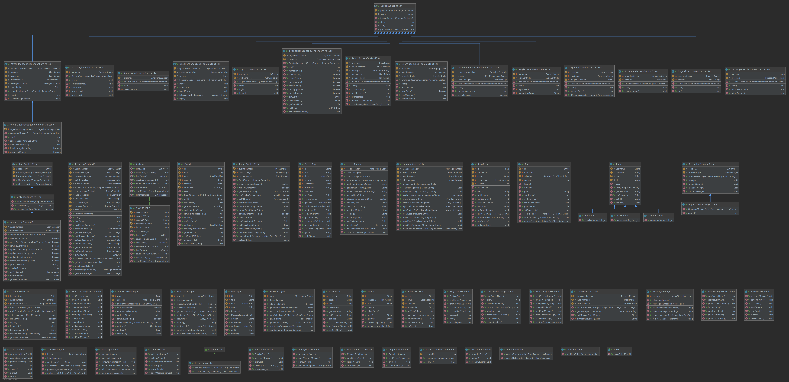

# CSC207 Project Phase 1 by group_074

INTRODUCTION
------------
About The Project: \
This project allows people login in as origanizer or attendee to communicate with each 
other in specific way. Basing off different type of user, users are able to sign up, cancel, schedule, manage their 
events and meet with speakers in conference and so on. After program finishing run, the information will be stored 
outside of the program in some .csc files.

This repo contains code, test, library of CSC207 project. This project was created by group_074: David Zijian Zhao, 
Haoze Huang, Leyi Wang, Ruoming Ren, Songchen Yuan, Yile Xie, Yi Tao Li, and Zewen Ma by alphabetical order.

The following link contains our design of CRC cards, zoom meeting link, and instructions of phase 1 and phase 2.

- [CRC Cards](https://docs.google.com/spreadsheets/d/1l-SYLEj1_Ms2hQXLZLau1G9BD_9kIWQR5ZxChHeDaMY/edit#gid=1740146710)
- [Zoom Meeting with TA](https://utoronto.zoom.us/j/88638797661)
- [Phase 1 Spec](https://q.utoronto.ca/courses/180703/pages/project-phase-1)
- [Phase 2 Spec](https://q.utoronto.ca/courses/180703/pages/project-phase-2)

Getting Started
------------

<<<<<<< HEAD
=======
**Pre-requisites**

* JDK 8 or above
* [opencsv v5.3](http://opencsv.sourceforge.net/)
>>>>>>> 02b2b115b113b8ab7919675d49d1fe905894d1ed

**Running the Application**

Run the main() method of main.controllers.main

**After Startup**

After starting the program, you will be faced with two options:
1. Login - Choose this option to login using an existing account
2. Register - Choose this option to create a new account

**Usage**

After logging in, you will be given a screen with a number of options depending on your user type. These are where
you will be able to register for events, send messsages, and check your messages. Organizers will have the additional 
capability to manage users, manage events and rooms, and save the data in the application.

**Data Management**

Organizers can manually save the data from their current session in the Data Management screen.

The program will automatically load saved data from previous sessions.

Contributors
------------

Github id     | Markus id    | Student id
------------- | -------------| -------------
oliphant0803  |  huan1825    | 1006073204
YvetteXie     |  xieyile1    | 1005822987
Hiraethwly    |  wangley6    | 1006318682
Luke9248      |  renruomi    | 1005889013 
kaka0905      |  mazewen1    | 1005968375
bravetheheat  |  zhaodav3    | 1003323423
AveritasR0679 |  stevenY     | 1005712873
Jimmy         |   liyi69     | 1002660499

Contribution Guideline
------------

In general, our project follow the "fork-and-pull" Git workflow.

Each of use fork the repo on GitHub and clone the project to our own machine; then we commit change to our own 
branch and commit changes to our own branch. By submitting a pull request, we merge our branch to main.

TA can check out the pull requests, addition and the java doc of each class that demonstrates the author 
who writes this class. 

UML Diagram
------------

 

