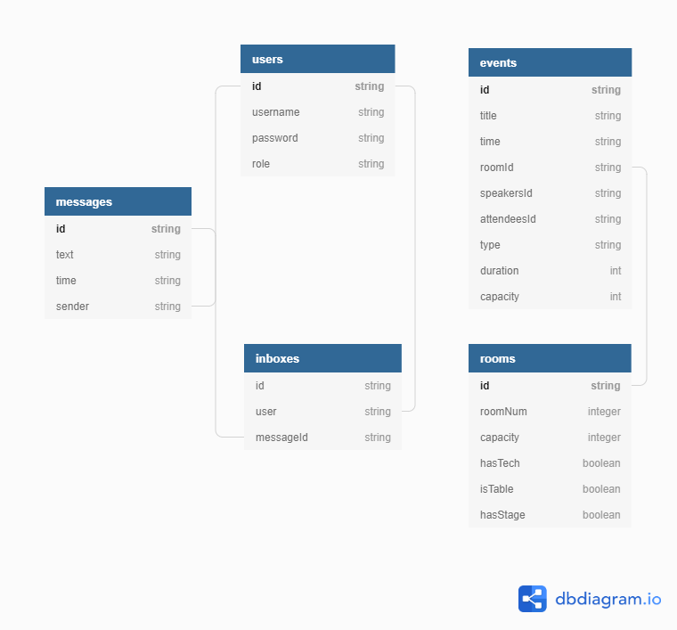

# CSC207 Project Phase 1 by group_074

INTRODUCTION
------------
About The Project: \
This project allows people login in as origanizer or attendee to communicate with each 
other in specific way. Basing off different type of user, users are able to sign up, cancel, schedule, manage their 
events and meet with speakers in conference and so on. After program finishing run, the information will be stored 
outside of the program in some .csc files.

This repo contains code, test, library of CSC207 project. This project was created by group_074: David Zijian Zhao, 
Haoze Huang, Leyi Wang, Ruoming Ren, Songchen Yuan, Yile Xie, Yi Tao Li, and Zewen Ma by alphabetical order.

The following link contains our design of CRC cards, zoom meeting link, and instructions of phase 1 and phase 2.

- [CRC Cards](https://docs.google.com/spreadsheets/d/1l-SYLEj1_Ms2hQXLZLau1G9BD_9kIWQR5ZxChHeDaMY/edit#gid=1740146710)
- [Zoom Meeting with TA](https://utoronto.zoom.us/j/88638797661)
- [Phase 1 Spec](https://q.utoronto.ca/courses/180703/pages/project-phase-1)
- [Phase 2 Spec](https://q.utoronto.ca/courses/180703/pages/project-phase-2)

Getting Started
------------

**Pre-requisites**

* JDK 8 or above
* [opencsv v5.3](http://opencsv.sourceforge.net/)
* [sqlite-jdbc v3.32](https://github.com/xerial/sqlite-jdbc)
* [j2html v1.4.0](https://github.com/tipsy/j2html)

**Running the Application**

Run the main() method of main.controllers.main

**After Startup**

After starting the program, you will be faced with two options:
1. Login - Choose this option to login using an existing account
2. Register - Choose this option to create a new account

**Usage**

After logging in, you will be given a screen with a number of options depending on your user type. These are where
you will be able to register for events, send messages, and check your messages. Organizers will have the additional 
capability to manage users, manage events and rooms, and save the data in the application.

**HTML Export**

You will be able to export the schedule of events to a HTML file. This will be available in the root directory at 
`event-list.html`.

**Data Management**

The program will automatically save data to `src/store/app.db`, an SQLite DB file, on exit. The program will 
also automatically load data from previous sessions from the same file.

Features
------------

* Ability to maintain data across sessions using an SQLite database.

* Ability to export list of events into a HTML file `event-list.html`

Design Patterns Used
------------

**Bridge**

The Bridge design pattern was used in our Gateway design to make it simple to extend to different data formats.

The interface: Gateway

The implementations: CSVGateway, SQLiteGateway

Implementing an alternate gateway destination would not affect other classes.

**Singleton**

We used the Singleton design pattern to ensure a consistent and single state within the application. Examples include 
our ProgramController, UsersManager, EventsManager, InboxManager, etc. (see ProgramController's constructor for more) 
where only a single instance is instantiated and *injected* into other classes.

**Builder**

We used builder for event in the use case (EventBuilder class) since there are multiple parameter for the event constructor 
and builder pattern can help with construction of this kind of object from its representation so that the 
same construction process can create a simpler representation of initializing an event.

**Simple Factory**

We used the Factory design pattern for the creation of new users and events as they both have multiple subtypes.

For events, we used the Factory design pattern in the EventFactory class since there are different types of events that may be constructed. 
Instead of using different classes to construct different types of events, a factory for event can 
decide which type of object it is creating.

For users, we implemented UserFactory which is a Factory method for adding new user by UsersManager. 
Since we are having four different type of users, organizer, attendee, speaker and admin under user entity class, 
if we want to add a new user type in the future that may extend user class. We just need to make some change 
in UserFactory instead of UsersManager so that it improves the extensibility for future types of users.  

Improvements in Design Since Phase 1
------------

We combined the subclass of users (Attendee, Organizer, Speaker, and later Admin) into a User class. The four subtypes of user do not differ
in functionality at the Entity level. Therefore, we recognized that there was no need to use inheritance for users. This decision has helped us to
remove redundant code and avoid unnecessary complexity in our program.

Contributors
------------

Github id     | Markus id    | Student id
------------- | -------------| -------------
oliphant0803  |  huan1825    | 1006073204
YvetteXie     |  xieyile1    | 1005822987
Hiraethwly    |  wangley6    | 1006318682
Luke9248      |  renruomi    | 1005889013 
kaka0905      |  mazewen1    | 1005968375
bravetheheat  |  zhaodav3    | 1003323423
AveritasR0679 |  stevenY     | 1005712873
Jimmy         |   liyi69     | 1002660499

Contribution Guideline
------------

In general, our project follow the "fork-and-pull" Git workflow.

Each of use fork the repo on GitHub and clone the project to our own machine; then we commit change to our own 
branch and commit changes to our own branch. By submitting a pull request, we merge our branch to main.

TA can check out the pull requests, addition and the java doc of each class that demonstrates the author 
who writes this class. 

SQL Table Schema
------------

Some parts of the schema represent serialized versions of arrays. E.g. events.speakersId. While the data format is 
a string, it represents a list of Speaker IDs

UML Diagram
------------
[Main UML (Only Core Classes; Methods Only)](./design.pdf)

[Connections UML (Only Core Classes)](./design-connections-only.pdf)

